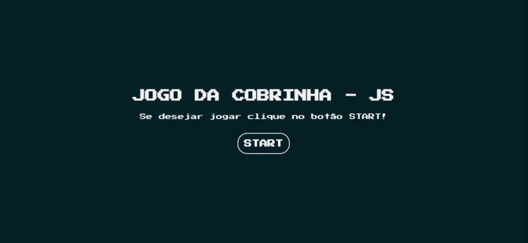
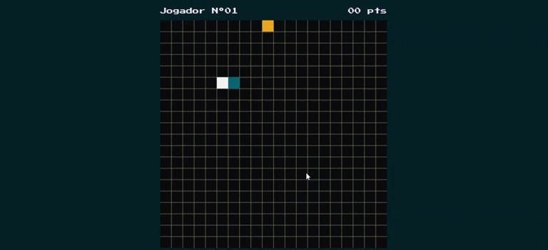
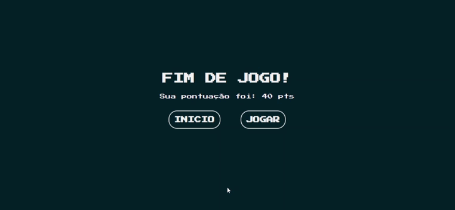

# Jogo da Cobrinha JS

### 💻 Sobre o projeto

- Jogo da Cobrinha JS – é um projeto para praticar o básico de JAVASCRIPT manipulando as propriedades da tag CANVAS.

- Com o intuito de projetar o famoso jogo retrô da cobrinha as funcionalidades do jogo foram replicadas e adaptadas em partes para tentar deixar a jogabilidade mais fluida e assim expondo os conhecimentos em JAVASCRIPT aplicados no projeto.

- O jogo tem algumas diretrizes básicas: 

1 - O jogador deve movimentar a cobra com o intuito de “comer” a frutinha que aparece de forma aleatória dentro do campo.

2 – Para cada frutinha que a cobra conseguir “comer” ela tem seu tamanho aumentado e 10 pontos são somados ao placar do jogador localizado na parte superior da tela.

3 – A cada X pontos feitos a movimentação da cobra tem um aumento de velocidade, aumentando assim a dificuldade do jogo.

4 – Caso a cabeça da cobra encoste no seu próprio corpo a partida encerra.

### 🎨 Layout

- A baixo o design da aplicação em execução.

1 - Tela inicial do jogo:

  

2 - Tela do jogo rodando:

  

3 - Tela fim de jogo:

  

### 🛠 Tecnologias

- As seguintes ferramentas foram usadas na construção do projeto:

- HTML
- CSS
- JAVASCRIPT

### 📝 Licença

- Fique a vontade para contribuir...

- Feito com ❤️ por Irani Junior 👋🏽
